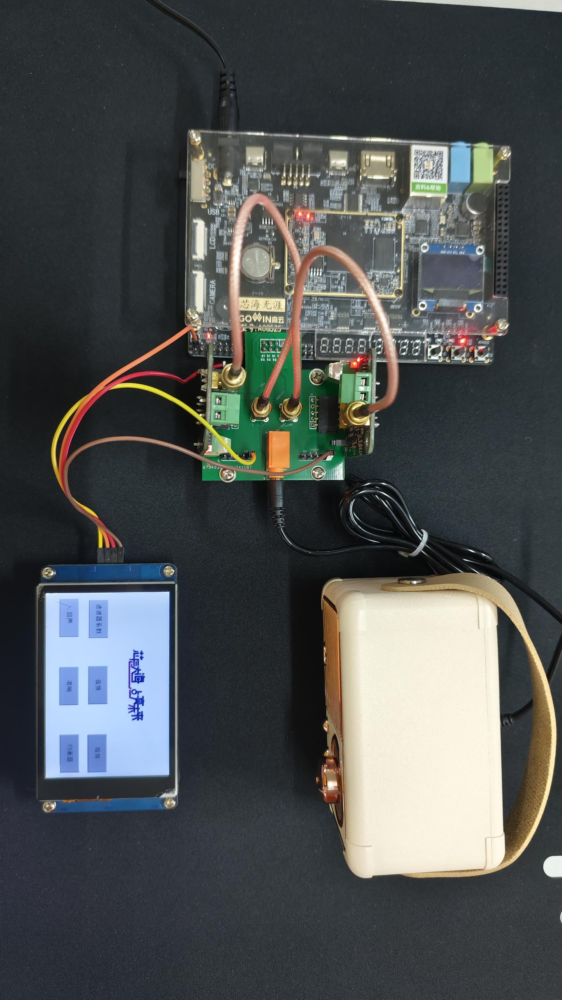
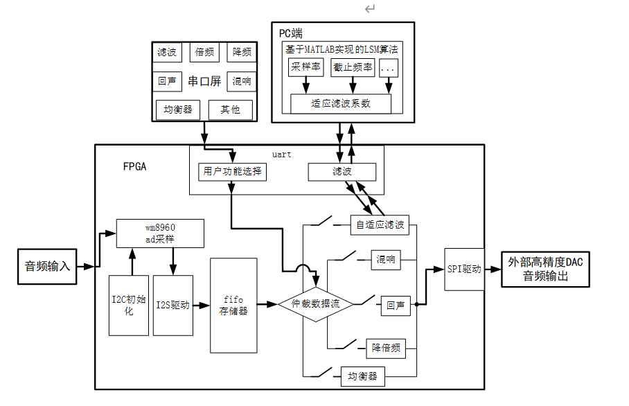

# 基于高云ACG525的音频处理系统

  
*图1：系统硬件展示*

## 项目简介
本项目基于高云ACG525 FPGA开发板，设计并实现了一个高精度实时音频处理系统。系统支持多种音效生成（混响、回声、均衡器等）、灵活采样率转换（最高768kHz）、低延迟音频处理，并提供用户友好的控制界面，适用于音乐创作、现场表演、录音室及音频后期制作等场景。

## 主要功能特性
- **实时音频处理**  
  - 支持混响、回声、8段均衡器、降噪等音效。
  - 音频采样率倍频（最高768kHz）与降频处理。
- **高精度信号转换**  
  - 板载WM8960芯片实现48kHz ADC采样。
  - 外接高精度DAC模块，信噪比高，失真度低。
- **用户交互与控制**  
  - 串口屏提供可视化菜单，实时调节音效参数（混响时间、均衡器增益等）。
  - 支持PC端MATLAB辅助滤波器参数计算，通过UART动态配置。
- **扩展性与兼容性**  
  - 预留接口支持多声道处理与高级功能扩展。
  - 串口通信速率可达115200bps，适配多种外部设备。

## 系统架构
  
*图2：系统模块框图*

### 核心模块
1. **数据采样与存储**  
   - WM8960芯片完成模拟音频信号的ADC采样，通过I2S协议存储至FIFO缓冲区。
2. **FPGA处理核心**  
   - 仲裁模块调度功能：自适应滤波、混响、回声、倍频/降频、均衡器。
   - 回声/混响：多FIFO延时反射模拟空间声学效果。
   - 倍频：线性插值+FIR低通滤波抑制镜像频谱。
3. **外部通信**  
   - UART模块连接串口屏与PC端，实现参数配置与远程控制。
4. **高精度输出**  
   - 外部DAC模块通过SPI协议输出高质量模拟音频信号。

## 安装与使用
### 硬件依赖
- 高云ACG525 FPGA开发板
- WM8960音频编解码芯片
- 外接高精度DAC模块（如TI PCM5102A）
- 串口触摸屏（支持UART通信）

### 软件环境
- 高云FPGA开发工具（编译与烧录）
- MATLAB（滤波器参数计算）
- 串口调试工具（如PuTTY）

### 快速启动
1. 连接音频输入源（麦克风/线路输入）与输出设备（扬声器）。
2. 通过I2C协议初始化WM8960芯片。
3. 使用串口屏选择音效模式并调节参数。
4. 运行MATLAB脚本计算滤波器系数，通过UART发送至FPGA。

## 性能参数
| 指标           | 参数详情                          |
|----------------|----------------------------------|
| 采样率         | 输入48kHz，输出最高768kHz        |
| 延迟           | <10ms（复杂音效场景）            |
| 均衡器频段     | 8段可调（低频/中频/高频细分）    |
| 通信接口       | UART@115200bps, SPI, I2C         |
| 动态范围       | >90dB（DAC输出）                 |

## 扩展方向
- **多声道支持**：扩展立体声/环绕声处理能力。
- **智能音效识别**：基于AI的自动参数调节。
- **音视频同步**：集成视频处理模块。
- **可视化分析**：实时频谱/波形显示功能。

## 贡献与许可
- **开源协议**：MIT License  
- **贡献指南**：欢迎提交Issue或PR。

## 致谢
- 感谢高云半导体提供的开发板与技术支援。
- 指导老师在项目设计与调试中的关键指导。

## 参考文献与资源
- [MATLAB LSM脚本示例](media/LSM算法.png)
- [1]	徐胜,文丰.基于FPGA的UART自适应接收IP核设计[J].单片机与嵌入式系统应用,2023,23(11):14-16+20.
- [2]	贝承荣,鲁文其,鲁玉军,等.基于变遗忘因子递推最小二乘法的永磁同步电机电参数辨识[J/OL].电子科技,1-13[2024-11-11].https://doi.org/10.16180/j.cnki.issn1007-7820.2025.09.002.
- [3]	巢一波.基于FPGA的音频处理系统[D].江南大学,2009.
- [4]	陈文锋,吕卫祥,夏东方,等.基于FPGA的宽带数字均衡器的设计与实现[J].雷达与对抗,2024,44(01):69-72.DOI:10.19341/j.cnki.1009-0401.2024.01.015.
---

**演示视频**：[YouTube/Bilibili链接](#)
